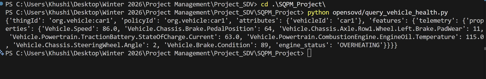

# SDV Pipeline – Iteration 2 (SQPM Project)

End-to-end pipeline:

Vehicle Simulator → Kuksa → Zenoh → Ditto → OpenSOVD-style query

## What this implements

- Core required stack for Iteration 1: **Kuksa + Ditto**
- Middleware layer: **Zenoh**
- Vehicle telemetry simulator in Python
- Digital twin update path into Ditto
- Iteration 2 extension:
	- Simulated sensor faults in the simulator:
		- Missing engine temperature signal every 8th cycle
		- Noisy brake pedal signal every 10th cycle
		- Delayed steering signal every 12th cycle
	- Continuous brake degradation model (pad wear increases over time)
	- Backend monitoring rules in digital twin pipeline:
		- `engine_status`: `NORMAL`, `OVERHEATING`, or `NO_DATA`
		- `brake_status`: `OK`, `WORN`, or `CRITICAL`

## Project structure

```text
SQPM_Project/
├── docker-compose.yml
├── ditto-docker-compose.yml
├── requirements.txt
├── nginx.conf
├── nginx-cors.conf
├── nginx.htpasswd
├── simulator/
│   └── vehicle_simulator.py
├── kuksa/
│   └── kuksa_reader.py
├── zenoh/
│   ├── zenoh_bridge.py
│   └── zenoh_to_ditto.py
├── ditto/
│   └── create_digital_twin.sh
└── opensovd/
		└── query_vehicle_health.py
```

## Prerequisites

- Docker Desktop (with Compose)
- Python 3.9+

Install Python dependencies:

```bash
pip install -r requirements.txt
```

Equivalent explicit packages:

```bash
pip install kuksa-client eclipse-zenoh requests
```

## Start infrastructure

From `SQPM_Project`:

```bash
docker compose up -d
docker compose -f ditto-docker-compose.yml up -d
```

## Initialize digital twin

In Git Bash / WSL:

```bash
bash ditto/create_digital_twin.sh
```

Or in PowerShell:

```powershell
Invoke-RestMethod -Method Put -Uri "http://localhost:8080/api/2/things/org.vehicle:car1" -Headers @{Authorization="Basic ZGl0dG86ZGl0dG8="} -ContentType "application/json" -Body '{"attributes":{"vehicleId":"car1"},"features":{"telemetry":{"properties":{"speed":0}}}}'
```

Ditto API auth credentials used by scripts: `ditto` / `ditto` (via nginx on `localhost:8080`).

## Run the pipeline

Open separate terminals in `SQPM_Project`:

1) Start simulator

```bash
python simulator/vehicle_simulator.py
```

2) Start Kuksa → Zenoh bridge

```bash
python zenoh/zenoh_bridge.py
```

3) Start Zenoh → Ditto bridge

```bash
python zenoh/zenoh_to_ditto.py
```

4) Query vehicle health / twin state

```bash
python opensovd/query_vehicle_health.py
```

## Iteration 2 extension behavior

The extension is implemented in:

- `simulator/vehicle_simulator.py` (fault injection and degradation)
- `zenoh/zenoh_to_ditto.py` (rule-based health status enrichment)

Expected runtime behavior:

- Simulator console prints cycle-level fault labels (`missing_engine_temp`, `noisy_brake_pedal`, `delayed_steering`).
- Ditto twin telemetry includes interpreted health fields:
	- `engine_status` based on temperature thresholds and missing data.
	- `brake_status` based on derived `Vehicle.Brake.Condition`.

This validates that the SDV pipeline can be extended with additional behavior in both source signals and backend logic without breaking end-to-end data flow.

## Iteration 2 non-functional experiment

To reproduce the non-functional evaluation (reliability + API latency comparison):

```bash
py experiments/iteration2_nonfunctional_experiment.py
```

Generated outputs:

- `docs/iteration2_nonfunctional_results.csv`
- `docs/iteration2_nonfunctional_results.md`

The markdown file includes:

- Results table (baseline vs faults enabled)
- Written analysis of observed behavior
- Summary conclusion for Iteration 2 reporting

## Stop everything

```bash
docker compose down
docker compose -f ditto-docker-compose.yml down
```
## Screenshots

### Docker Services Running


### Vehicle Simulator Publishing Signals


### Kuksa Reading Back Signals


### Zenoh Bridge Forwarding Data


### Zenoh to Ditto Bridge


### Digital Twin State in Ditto


### Engine Overheating Rule Triggered


### OpenSOVD Health Query


## Contributors

| Name | Contribution |
|---|---|
| Khushi Patel | Kuksa setup, vehicle simulator, report formatting |
| Prabhnoor Saini | Eclipse Ditto setup, digital twin creation, evidence collection |
| Harsh Patel | Eclipse Zenoh bridge, Kuksa-Ditto data transport |
| Lawrence Arryl Lopez | System architecture diagram, sequence diagram |
| Pranav Ashok Chaudhari | Functional modification (Vehicle.Brake.Condition), OpenSOVD integration, GitHub repository management |
